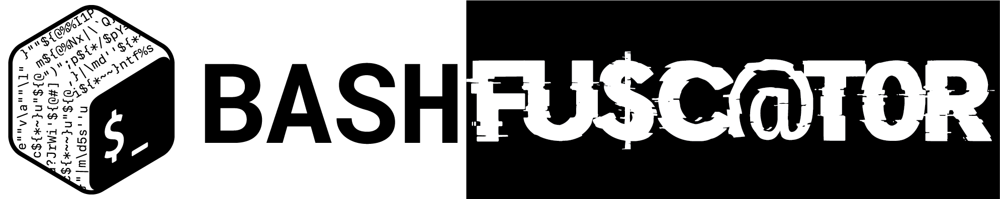

# Bashfuscator

[Documentation](https://bashfuscator.readthedocs.io/en/latest/index.html)

## What is Bashfuscator?

Bashfuscator is a modular and extendable Bash obfuscation framework. It provides numerous different ways of making Bash one-liners or scripts more difficult to understand. It does this by mutating or obscuring the input Bash code, then generating Bash code that will decode the obscured input so Bash can execute it. Bashfuscator makes generating highly obfuscated Bash commands and scripts easy, both from the command line and as a Python library.

The purpose of this project to give Red Team the ability to bypass static detections on a Linux system, and the knowledge and tools to write better Bash obfuscation techniques.

This framework was also developed with Blue Team in mind. With this framework, Blue Team can easily generate thousands of unique obfuscated scripts or commands to help create and test detections of Bash obfuscation.

## Installation

On a Debian-based distro, run this command to install dependencies:

`sudo apt-get update && sudo apt-get install python3 python3-pip python3-argcomplete xclip`

On a RHEL-based distro, run this command to install dependencies:

`sudo dnf update && sudo dnf install python3 python3-pip python3-argcomplete xclip`

Then, run these commands to clone and install Bashfuscator:

```bash
git clone https://github.com/Bashfuscator/Bashfuscator
cd Bashfuscator
python3 setup.py install --user
```

Note that only Debian and RHEL based distros are supported. Also, Bashfuscator is written in Python 3, Python 2 is *not* supported.

## Example Usage

For simple usage, just pass the command you want to obfuscate with `-c`, or the script you want to obfuscate with `-f`.

```bash
$ bashfuscator -c "cat /etc/passwd"
[+] Payload:

  $*''\p\r''in''\t\f   %s   "$(   Cbg=(\} a \~ \* \{ \/ \  e c \) \" \< l v \' \$ d \( p w r t \@ s);for A9Cxo1m in 6 6 15 4 3 0 10 10 7 13 1 14 14 12 6 6 6 10 15 17 6 6 20 7 13 6 11 11 11 14 16 19 23 23 1 18 5 8 21 7 5 6 21 1 8 14 6 6 9 10 6 6 15 4 3 2 6 0 6 6 6 15 4 22 2 2 6 0;do printf %s "${Cbg[$A9Cxo1m]}";done )"   ${*,  } "$@"|  ${*#mZ2bu   }  ${@#<@ywi  }""\b\a\s""h ${*,   }   ${*~   }

[+] Payload size: 395 characters
```

You can copy the obfuscated payload to your clipboard with `--clip`, or write it to a file with `-o`.

For more detailed usage and examples, please refer to the [documentation](https://bashfuscator.readthedocs.io/en/latest/Usage.html).

## Extending the Framework

Adding new obfuscation methods to the framework is simple, as Bashfuscator was built to be a modular and extendable framework. Bashfuscator's backend does all the heavy lifting so you can focus on writing robust obfuscation methods (documentation on adding modules coming soon).

## Authors and Contributers

- Andrew LeFevre ([capnspacehook](https://github.com/capnspacehook)): project lead and creator
- Charity Barker ([cpbarker](https://github.com/cpbarker)): team member
- Nathaniel Hatfield ([343iChurch](https://github.com/343iChurch)): team member
- Elijah Barker ([elijah-barker](https://github.com/elijah-barker)): writing the Hex Hash, Folder and File Glob Mutators
- Sam Kreischer: the awesome logo

## Credits

- [danielbohannon](https://github.com/danielbohannon), whose excellent [Invoke-Obfuscation](https://github.com/danielbohannon/Invoke-Obfuscation) and [Invoke-DOSfuscation](https://github.com/danielbohannon/Invoke-DOSfuscation) projects gave [capnspacehook](https://github.com/capnspacehook) the idea to start writing Bashfuscator, and insight on how to write robust obfuscation methods.
- [DissectMalware](https://github.com/DissectMalware), whose tweets on Bash obfuscation formed the backbone of some Mutators, and provided ideas for other obfuscation techniques.
- [ConsciousHacker](https://github.com/ConsciousHacker), whose insight and advice has helped the team greatly.
- Bash logo was originally  from https://github.com/odb/official-bash-logo.

## Disclaimer

Bashfuscator was created for educational purposes *only*, use only on computers or networks you have explicit permission to do so. The Bashfuscator team is not responsible for any illegal or malicious acts preformed with this project.
